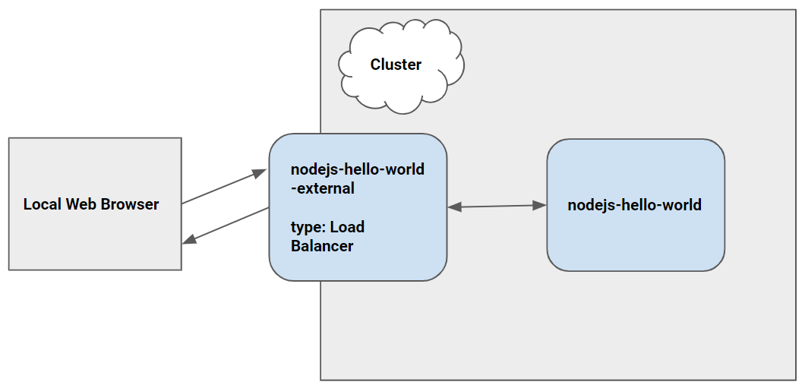
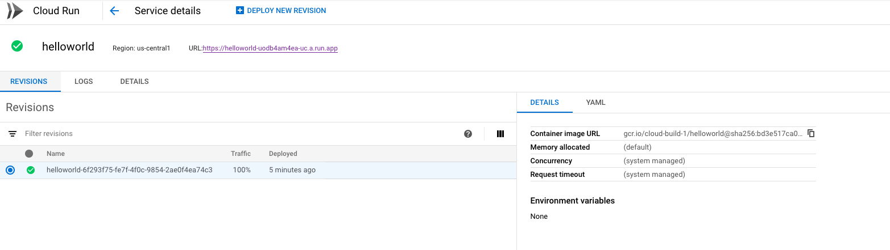

# Hello World with Cloud Code



"Hello World" is a simple Kubernetes application that contains a single
[Deployment](https://kubernetes.io/docs/concepts/workloads/controllers/deployment/) and a corresponding
[Service](https://kubernetes.io/docs/concepts/services-networking/service/). The Deployment contains a
web server that simply prints "Hello World".

----

## Table of Contents

### Cloud Code for Visual Studio Code

1. [Getting Started](#getting-started])
2. [What's in the box](https://cloud.google.com/code/docs/vscode/quickstart#whats_in_the_box)
3. Using Cloud Code
    * [Set up a Google Kubernetes Engine Cluster](https://cloud.google.com/code/docs/vscode/quickstart#creating_a_google_kubernetes_engine_cluster)
    * [Deploy the app](https://cloud.google.com/code/docs/vscode/quickstart#deploying_your_app)
    * [Continuous Deployment](https://cloud.google.com/code/docs/vscode/quickstart#initiating_continuous_deployment)
    * [View Container Logs](https://cloud.google.com/code/docs/vscode/quickstart#viewing_container_logs)
    * [Debug Your Code](https://cloud.google.com/code/docs/vscode/quickstart#debugging_your_application)
    * [Open a Terminal in Your Container](https://cloud.google.com/code/docs/vscode/quickstart#opening_a_terminal_in_your_container)
4. [Using the Command Line](#using-the-command-line)
    * [Skaffold](#using-skaffold)
    * [kubectl](#using-kubectl)

----

### Getting Started

This sample was written to demonstrate how to use the Cloud Code extension for Visual Studio code.

* [Install Cloud Code for VS Code](https://cloud.google.com/code/docs/vscode/install)
* [Creating a new app](https://cloud.google.com/code/docs/vscode/creating-an-application)
* [Editing YAML files](https://cloud.google.com/code/docs/vscode/yaml-editing)

----

## Three options

1. Cloud run vanilla

### Containerizing an app and uploading it to Container Registry

```bash
gcloud builds submit --tag gcr.io/cloud-build-1/helloworld #Build your container image using Cloud Build. The image is stored in Container Registry and can be re-used if desired

```

#### Deploy to cloud run 

```bash
gcloud beta run deploy --image gcr.io/cloud-build-1/helloworld #respond y to allow unauthenticated invocations.

```

> Cloud Run automatically and horizontally scales your container image to handle the received requests, then scales down when demand decreases. You only pay for the CPU, memory, and networking consumed during request handling.



2. Cloud run on GKE with istio and knative

```bash

gcloud beta container clusters create shane-gke \
  --addons=HorizontalPodAutoscaling,HttpLoadBalancing,Istio,CloudRun \
  --machine-type=n1-standard-4 \
  --cluster-version=latest \
  --zone=us-central1-a \
  --enable-stackdriver-kubernetes --enable-ip-alias \
  --scopes cloud-platform

gcloud config set run/cluster [shane-gke]
gcloud config set run/cluster_location us-central1-a

gcloud beta run deploy --image gcr.io/cloud-build-1/helloworld --cluster shane-gke

#Scroll down to the istio-ingressgateway service and copy the external IP address shown next to the Load Balancer. Ignore the other values.

curl -H "Host: helloworld.default.example.com" [LOAD_BALANCER_IP] #access the service

  ```

  > Note that although these instructions don't enable cluster autoscaling to resize clusters for demand, Cloud Run on GKE automatically scales instances within the cluster.


### Using the Command Line

As an alternative to using the Cloud Code extension, the application can be deployed to a cluster using standard command line tools

#### Skaffold

[Skaffold](https://github.com/GoogleContainerTools/skaffold) is a command line tool that can be used to build, push, and deploy your container images

```bash
skaffold run --profile cloudbuild -v=debug
```

Currently get  an error 

```bash
FATA[0002] build failed: building [gcr.io/cloud-build-1/helloworld]: checking bucket is in correct project: iterating over buckets: Get https://www.googleapis.com/storage/v1/b?alt=json&pageToken=&prefix=cloud-build-1_cloudbuild&project=cloud-build-1&projection=full: oauth2: cannot fetch token: unexpected EOF 
```


#### kubectl

[kubectl](https://kubernetes.io/docs/tasks/tools/install-kubectl/) is the official Kubernetes command line tool. It can be used to deploy Kubernetes manifests to your cluster, but images must be build seperately using another tool (for example, using the [Docker CLI](https://docs.docker.com/engine/reference/commandline/cli/))

## Resources

- [Quickstarts](https://cloud.google.com/run/docs/quickstarts)
